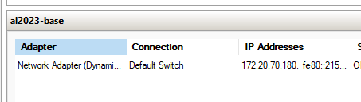
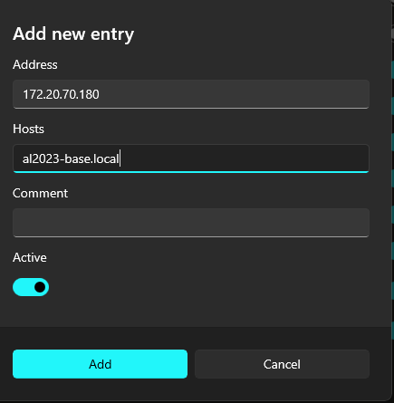

# Amazon Linux 2023 (AL2023) on Hyper V

This repo deails how to launch an instance of Amazon Linux 2023 to a Hyper-V VM. 

Since AL2023 only works with cloud-init, we need to make a seed.iso file to the Amazon provided image with the right user data (adding password, keys, etc)

These steps cover the general process of launching the instance. For specific steps on creating and deploying a Vagrant Box (recommended) or a Hyper-V template to import, including premade seed.iso files, follow the steps in the respective folders in this repo: 

### Vagrant Box: [vagrant-box](vagant-box)

### Hyper-V Template: [hyper-v-template](hyper-v-template)  

---

### Prerequisites: 
A linux terminal (i.e. WSL), genisoimage in Linux (i.e. apt install genisoimage)  
AL2023 base image can be found at: https://cdn.amazonlinux.com/al2023/os-images/latest/

## 1. Create user-data file
Copy user-data.template to user-data and replace \_\_SSH_KEY\_\_ with your actual ssh pubic key. Snippet below:

```sh
...
    ssh_authorized_keys:
      - __SSH_KEY__
    lock_passwd: false
    # Set password as password
    #passwd: "$6$/EcnIbxiVa3zpvGi$ivoX7m/BL85E3SULpq2PHIqr2MLl0IaubOPAdpCheIZ1KF4W6618YlaLng.ve2r6lUlP5v.qqBOCcasL4ATpd1"
hostname: al2023
...
```

To set a password (ec2-user/password), uncomment out the passwd line in user-data.

Optional: You can configure the meta-data file too to whatever you want, the config in this repo works fine for testing.

## 2. Create seed.iso file
Run this command (this only works in Linux, alternate steps exist for Windows)

```sh
genisoimage -output seed.iso -volid cidata -joliet -rock user-data meta-data
```

Username and password: ec2-user/password

Optional: You can automatically add your own SSH key with these commands

```sh
export SSH_KEY="$(cat ~/.ssh/id_rsa.pub)"

sed \
  -e "s|__SSH_KEY__|$SSH_KEY|" \
  user-data.template > user-data

genisoimage -output seed.iso -volid cidata -joliet -rock user-data meta-data

```

## 3. Download and save Hyper-V image
Create a directory for your seed.iso file and the Hyper V template from Amazon e.g. C:\Users\<your_user>\hyperv\al2023-base

Copy the seed.iso file to this location.

Download the Hyper V disk and save it and extract it to here. The format should be VHDX. It may be in a nester folder.

## 4. Create the VM
In Hyper V Create the VM:
- New -> Virtual Machine
- Name: al2023-base
- Generation 2
- Assign memory: 2048 MB
- Configure Networking: Default Switch
- Use an existing Virtual hard disk: Choose the VHDX file you extracted in step 4.
- Create virtual machine

## 5. Configure VM
Navigate to the VM's settings. 
- Security: Uncheck 'Enable secure boot' (AL2023 does not support Hyper V secure boot)
- SCSI Controller: 
    - Add a DVD drive
    - Image file: The seed.iso file you created i.e C:\Users\<your_user>\hyperv\al2023-base.local\seed.iso
    - Optional: Disable checkpoints if you don't want them.

## 6. Start the VM
Start the VM in Hyper V.

## 7. Connect to the VM
The IP address should show up in the Networking tab of the VM in Hyper V. You can update your hosts file with this. This is not static, it will reset when the computer resets.



I recommend using Windows PowerToys GUI for the hosts file



SSH into the VM in Powershell or WSL

```sh
ssh ec2-user@al2023-base.local
```
Notes: If you're using WSL, you will need to run the following Powershell command to reach Hyper V from WSL. This is not persistent config and will need to be run every time you restart your computer.
```ps
Get-NetIPInterface | where {$_.InterfaceAlias -eq 'vEthernet (WSL (Hyper-V firewall))' -or $_.InterfaceAlias -eq 'Default Switch'} | Set-NetIPInterface -Forwarding Enabled -Verbose
``