# Amazon Linux 2023 Hyper-V Template

These steps create a Hyper-V template which can be imported as a new VM. This repo includes a ready made seed.iso file for launching an Amazon Linux 2023 (AL2023) instance on Hyper-V. The Hyper-V image can be downloaded here https://cdn.amazonlinux.com/al2023/os-images/latest/

To do this, we will boot the VM with the provided seed.iso file (which adds the insecure key), then export the VM to a template. The steps below cover the proess.

When the template is deployed, it can be accessed with the `ec2-insecure-access.pem` key. This key will automatically be deleted on first sign in, so the first step after deployment must be to add your own key.

## Create a template

### 1. Download Hyper-V image
Download the Hyper-V image from Amazon, and the seed.iso file from this folder `hyper-v-template/seed.iso`.

### 2. Create VM
In Hyper-V, create a new VM: Actions >> New >> Virtual Machine.  
Create the VM with the following settings, but *don't* start it when done.
 - Name: al2023-hyperv-template
    - Location doesn't matter - we'll be exporting it anyway.
 - Specify Generation: Generation 2
 - Assign Memory: 1024 MB  
    - Dynamic memory: optional
 - Configure Networking: Default Switch
 - Connect Virtual Hard Disk:  
 Use an existing virtual disk: `"C:\path\to\al2023-hyperv-2023.7.20250512.0-kernel-6.1-x86_64.xfs.gpt.vhdx"`

### 3. Configure VM settings
Before starting the VM, right click and press Settings and set:
 - Security: Disable Secure Boot
 - Processor: Set to 1 or 2 if not already there
 - Checkpoints: Disable checkpoints
Apply changes, but stay in settings.

### 4. Attach `seed.iso`
While still in settings, attach the seed.iso:
 - SCSI Controller:
    - DVD Drive - Add
 - DVD Drive: 
    - Media: Image File: `C:\path\to\seed.iso`
Setting should look like the screenshot below. Apply changes. Exit settings.

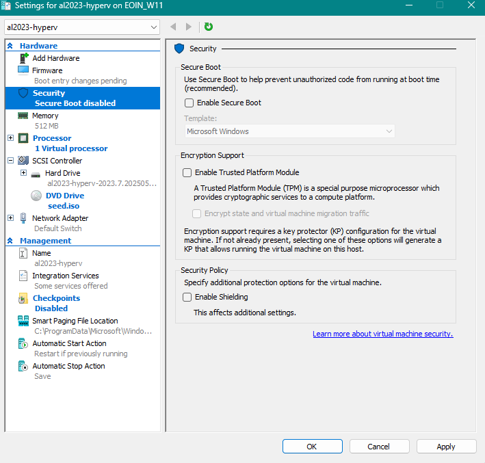

### 5. Start the VM
Start the VM. This should initialize it, and add the insecure key for the template. This will take about 30 seonds, you'll know it's done when the machine posts an IP address to the Hyper-V network tab. 

**Do not** access the machine, otherwise the first login logic will trigger and the insecure key will be deleted.

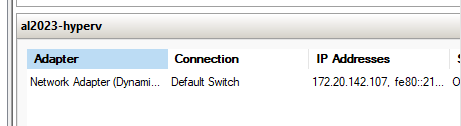

### 6. Turn off and Export the VM
Turn off the VM (right click - Turn off).

**Important**: Before exporting the VM, remove the DVD drive in the settings.

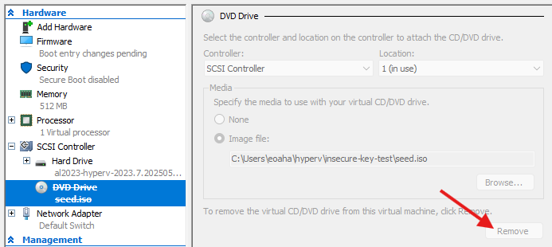

Right click the VM and click Export..., then save it somewhere on your computer. e.g. `C:\Users\<your_user>\hyperv\templates`

This should produce a folder something like this:

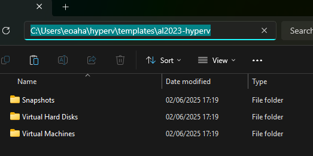

### 7. Zip up your template
Compress your template and call it something like `Golden-AL2023-Hyper-V-Base.zip`.  

This is now your Golden Template you can reuse!

## Deploy the template

You can deploy the template manually in Hyper-V. It is best to create a new directory to store the VM in. Hyper-V tends to store virtual hard drives in a flat directory structure, so when they have these drives have the same name (as in our template) there can be conflict. 

To deploy this template we will be 
 1. Unzipping a copy of our VM.
 2. Creating a target directory for the VM and Virtual Hard Disk.
 3. Importing in Hyper-V as a *copy* (details below).

### 1. Create location for VM
Create a directory to deploy this VM into, like `C:\Users\<your_user>\hyperv\deplo-template-test`

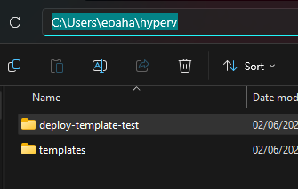

### 2. Unzip your template
Unzip a copy of your template from your templates folder. The template folder `al2023-hyperv` is inside this extracted folder (you can actually reuse this if you want to keep it unzipped, as the machine will be copied to the directory from step 1).

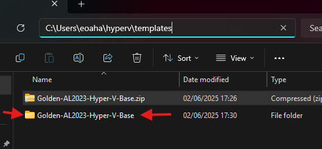

### 3. Import the VM

In Hyper-V choose 'Import Virtual machine'

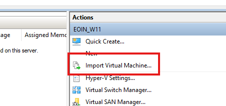

Select the extracted template as the import source. This will be the folder inside the folder above

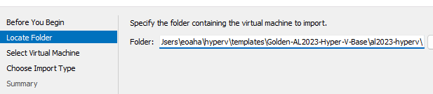

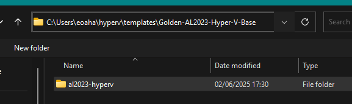

Select the VM we created

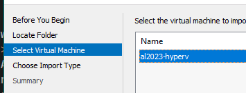

Import type **must be** Copy

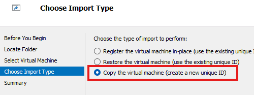

For Choose Destination use the directory we created in Step 1

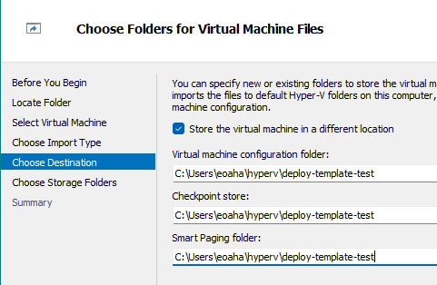

For Choose Storage Folders use a folder "Virtual Hard Disks" inside this directory (no  need to create this in advance, the installer will create it)

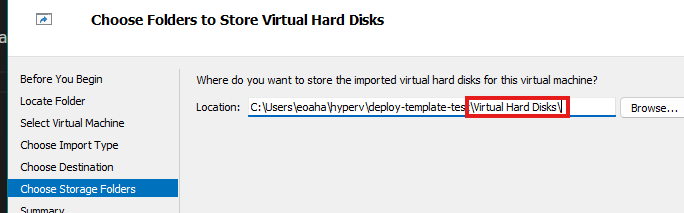

Now my summary looks like this. Deploy the VM by choosing 'Finish'

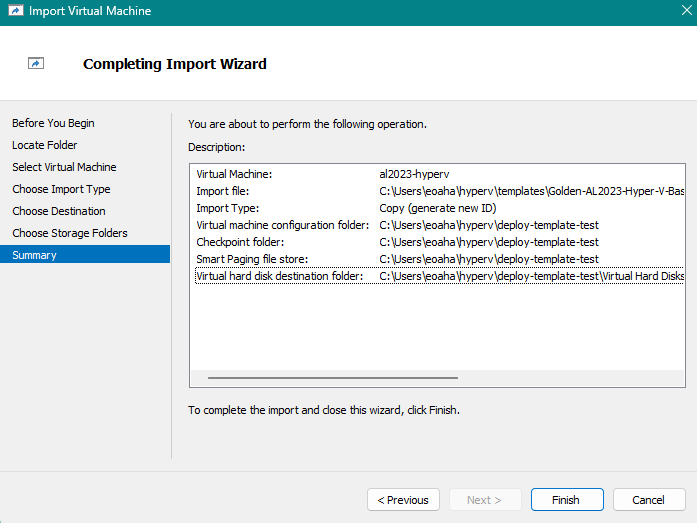

### 4. --INFO-- Adding your public key

This repo contains a private key for accessing the instance for the first time `ec2-insecure-access.pem`.

After you access for the first time, the insecure key will be deleted. If you do not add your own public key on first login, the instance will be inacessible  and you will have to deploy a new one. 

I recomend using the following command (Linux) to send your own public key in before ou sign in for the first time:

```
cat ~/.ssh/id_rsa.pub | ssh -i ec2-insecure-access.pem ec2-user@<instance_ip> 'cat >> ~/.ssh/authorized_keys && chmod 600 ~/.ssh/authorized_keys'
```
If you cannot use this command, just make sure that the first time you log in you add your public key to `/home/ec2-user/.ssh/authorized_keys`.

### 5. Start the machine and add your public key

Start up the machine. The IP should appear in Hyper-V's network tab

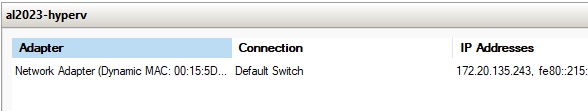

**The first thing you should do** is add your public key.

```sh
cat ~/.ssh/id_rsa.pub | ssh -i ec2-insecure-access.pem ec2-user@172.20.135.243 'cat >> ~/.ssh/authorized_keys && chmod 600 ~/.ssh/authorized_keys'
```
If this command doesn't work for you, simply ssh in with the insecure private key and add your public key manually to `/home/ec2-user/.ssh/authorized_keys`.
```
ssh -i ec2-insecure-access.pem ec2-user@172.20.130.188
```
Demo:
```sh
[wsl-debian]:[~]$ cat ~/.ssh/id_rsa.pub | ssh -i ec2-insecure-access.pem ec2-user@172.20.135.243 'cat >> ~/.ssh/authorized_keys && chmod 600 ~/.ssh/au
thorized_keys'

The authenticity of host '172.20.135.243 (172.20.135.243)' can't be established.
ED25519 key fingerprint is SHA256:witM+Khi+YfuQaskFimkpLEEtlp4WULhOSKg4/LYKik.
This key is not known by any other names.
Are you sure you want to continue connecting (yes/no/[fingerprint])? yes
Warning: Permanently added '172.20.135.243' (ED25519) to the list of known hosts.
```
You should now be able to access with your own public key

```sh
[wsl-debian]:[~]$ ssh ec2-user@172.20.135.243
   ,     #_
   ~\_  ####_        Amazon Linux 2023
  ~~  \_#####\
  ~~     \###|
  ~~       \#/ ___   https://aws.amazon.com/linux/amazon-linux-2023
   ~~       V~' '->
    ~~~         /
      ~~._.   _/
         _/ _/
       _/m/'
Insecure key has been removed, make sure to add your own public key to ~/.ssh/authorized_keys if you have not already done so.
[ec2-user@localhost ~]$
```


