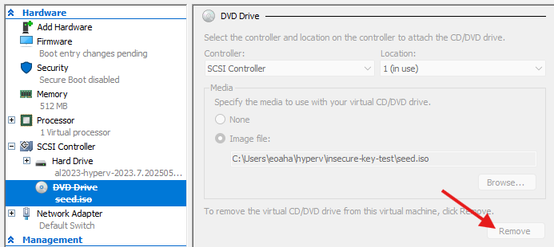

# Create a Vagrant Box of Amazon Linux 2023

These steps create a Vagrantbox for Hyper-V of Amazon Linux 2023. This repo includes a ready made seed.iso file cloud-init. The Hyper-V image can be downloaded here https://cdn.amazonlinux.com/al2023/os-images/latest/

The Vagrant box made with this repo can be found in the S3 bucket in [s3uri.txt](s3uri.txt) (not publically accessible).

To do this, we will boot the VM with the provided seed.iso file (which adds the insecure key), then export the VM to a template. The steps below cover the proess.

---

### 1. Download Hyper-V image
Download the Hyper-V image from Amazon, and the seed.iso file from this folder `hyper-v-template/seed.iso`.

### 2. Create VM
In Hyper-V, create a new VM: Actions >> New >> Virtual Machine.  
Create the VM with the following settings, but *don't* start it when done.
 - Name: al2023-hyperv-vagrant-box
    - Location doesn't matter - we'll be exporting it anyway.
 - Specify Generation: Generation 2
 - Assign Memory: 1024 MB  
    - Dynamic memory: optional
 - Configure Networking: Default Switch
 - Connect Virtual Hard Disk:  
 Use an existing virtual disk: `"C:\path\to\al2023-hyperv-2023.7.20250512.0-kernel-6.1-x86_64.xfs.gpt.vhdx"`

### 3. Configure VM settings
Before starting the VM, right click and press Settings and set:
 - Security: Disable Secure Boot
 - Processor: Set to 1 or 2 if not already there
 - Checkpoints: Disable checkpoints
Apply changes, but stay in settings.

### 4. Attach `seed.iso`
While still in settings, attach the seed.iso:
 - SCSI Controller:
    - DVD Drive - Add
 - DVD Drive: 
    - Media: Image File: `C:\path\to\seed.iso`
Apply changes. Exit settings.

### 5. Start the VM
Start the VM to initialize it, which adds the vagrant key.

### 6. Turn off and Export the VM
Turn off the VM (right click - Turn off).

**Important**: Before exporting the VM, remove the DVD drive in the settings.

Right click the VM and click Export..., then save it somewhere on your computer. e.g. `C:\Users\<your_user>>\hyperv\`



### 7. Confirm the export
The exported folder should look like this 
```
.
├── Snapshots
├── Virtual Hard Disks
└── Virtual Machines
```

### 8. Add Vagrantfile and Metadata
Place the following `Vagrantfile` and a `metadata.json` file in this directory structure, so that it looks like this:
```
.
├── metadata.json
├── Snapshots
├── Vagrantfile
├── Virtual Hard Disks
└── Virtual Machines
```


Vagrantfile:
```ruby
Vagrant.configure("2") do |config|
  config.vm.provider "hyperv"
end
```
metadata.json
```json
{ "provider": "hyperv" }
```
### 9. Archive into a box
Using **Powershell** run this command from **inside** the directory:
```ps
tar -cvf al2023-hyperv.box metadata.json Vagrantfile "Virtual Machines" "Virtual Hard Disks" "Snapshots" 
```
This creates a .box file with the following structure. For this to work as a vagrant box, it must have this structure. If you compress this from outside the directory, the tar may hav ea directory internally which will not work with vagrant.
```ps
├── metadata.json
├── Snapshots
├── Vagrantfile
├── Virtual Hard Disks
└── Virtual Machines     
```
### 10. Add the new box to Vagrant
Vagrant must be run in an Admin Powershell instance to work with the Hyper-V provider.

Run this command from Powershell to add the box to vagrant  
`vagrant box add .\al2023-hyperv.box --name hayeseoin/al2023-hyperv`

```ps
> vagrant box add .\al2023-hyperv.box --name hayeseoin/al2023-hyperv

==> box: Box file was not detected as metadata. Adding it directly...
==> box: Adding box 'hayeseoin/al2023-hyperv' (v0) for provider:
box: Unpacking necessary files from: file://C:/Users/eoaha/hyperv/vagrant-box/al2023-vagrant/al2023-hyperv.box 
box: 
==> box: Successfully added box 'hayeseoin/al2023-hyperv' (v0) for ''! 
```

# Deploy with Vagrant
Test this new box with Vagrant. Create a new directory and add the minimal Vagrantfile below 
```ruby
Vagrant.configure("2") do |config|
  # Disable SMB share
  config.vm.synced_folder ".", "/vagrant", disabled: true

  # VM deploy
  config.vm.define "node1" do |node|
    node.vm.box = "hayeseoin/al2023-hyperv"
    node.vm.hostname = "node1"
    node.vm.network "public_network", bridge: "Default Switch"

    node.vm.provider "hyperv" do |h|
      h.vmname = "al2023-node1"
      h.memory = 512
      h.cpus   = 1
      h.enable_checkpoints = false
    end
  end
end
```
Run `vagrant up` in Powershell to create the virtual machine.

```ps
> vagrant up
Bringing machine 'node1' up with 'hyperv' provider...
==> node1: Verifying Hyper-V is enabled...
==> node1: Verifying Hyper-V is accessible...
==> node1: Importing a Hyper-V instance
    node1: Creating and registering the VM...
    node1: Successfully imported VM
    node1: Configuring the VM...
    node1: Setting VM Enhanced session transport type to disabled/default (VMBus)
==> node1: Starting the machine...
==> node1: Waiting for the machine to report its IP address...
    node1: Timeout: 120 seconds
    node1: IP: 172.28.73.66
==> node1: Waiting for machine to boot. This may take a few minutes...
    node1: SSH address: 172.28.73.66:22
    node1: SSH username: vagrant
    node1: SSH auth method: private key
    node1: 
    node1: Vagrant insecure key detected. Vagrant will automatically replace
    node1: this with a newly generated keypair for better security.
    node1: 
    node1: Inserting generated public key within guest...
    node1: Removing insecure key from the guest if it's present...
    node1: Key inserted! Disconnecting and reconnecting using new SSH key...
==> node1: Machine booted and ready!
==> node1: Setting hostname...
```


Test access with `vagrant ssh node1`.
``` sh
PS C:\Users\eoaha\hyperv\vagrant-box\vagrant-test> vagrant status`
Current machine states:

node1                     running (hyperv)

PS C:\Users\eoaha\hyperv\vagrant-box\vagrant-test> vagrant ssh node1 

   ,     #_
   ~\_  ######_        Amazon Linux 2023
  ~~  \_#######\
  ~~     \####|
  ~~       \#/ ___   https://aws.amazon.com/linux/amazon-linux-2023
   ~~       V~' '->
    ~~~         /
      ~~._.   _/
         _/ _/
       _/m/'
[vagrant@node1 ~]$ 

```

Destroy when done with `vagrant destroy -f`.
```ps
PS C:\Users\eoaha\hyperv\vagrant-box\vagrant-test> vagrant destroy -f
==> node1: Stopping the machine...
==> node1: Deleting the machine...
```

